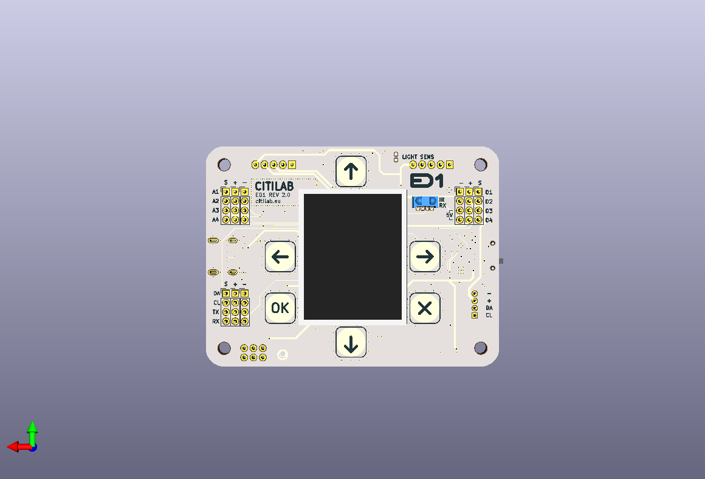

# ED1 Citilab Board - Home Assistant Integration

ESPHome configuration for integrating the [ED1 Citilab](https://citilab.eu) ESP32 educational board with Home Assistant.



## Features

### Implemented
- **1.44" TFT Display** (ST7735) - Shows device status, IP, temperature
- **32x8 LED Matrix** (WS2812) - Controllable from Home Assistant
- **6 Capacitive Touch Buttons** - Exposed as binary sensors
- **Light Sensor** - Ambient light percentage
- **Buzzer** - PWM audio output
- **Bluetooth Proxy** - Extends Home Assistant BLE range
- **WiFi Signal & Uptime Sensors**
- **CPU Temperature Monitoring**

### Planned (Hardware Available)
- IR Receiver (38kHz) - *RMT driver conflict with LED matrix in ESP-IDF 5.5*
- Accelerometer (MXC6655XA)
- Stepper Motor Control (2x 28BYJ-48)
- I/O Expander (MCP23009)

## Prerequisites

- [Home Assistant](https://www.home-assistant.io/) with [ESPHome Add-on](https://esphome.io/guides/getting_started_hassio.html)
- ED1 Citilab Board (Rev 2.3)
- USB-C cable
- [CP210x USB Driver](https://www.silabs.com/developers/usb-to-uart-bridge-vcp-drivers) (required for USB communication)

## Quick Start

1. **Clone this repository**
   ```bash
   git clone https://github.com/YOUR_USERNAME/ed1-hoas.git
   ```

2. **Configure secrets**
   ```bash
   cp secrets.sample.yaml secrets.yaml
   # Edit secrets.yaml with your credentials
   ```

3. **Copy to ESPHome**

   Choose a sample configuration:
   - `samples/ed1-full-features.sample.yaml` - All features (recommended)
   - `ed1-rev23-a.sample.yaml` - Minimal configuration

   Copy your chosen sample and `secrets.yaml` to your ESPHome config directory.

4. **Install on device**

   In Home Assistant ESPHome add-on:
   - Click "+ NEW DEVICE"
   - Select "Pick file" and choose the YAML
   - Connect ED1 via USB and flash

5. **Add to Home Assistant**

   The device will be auto-discovered. Accept the integration to add all entities.

## File Structure

```
ed1-hoas/
├── samples/
│   └── ed1-full-features.sample.yaml  # All features enabled
├── ed1-rev23-a.sample.yaml   # Minimal sample configuration
├── secrets.sample.yaml       # Template for secrets
├── secrets.yaml              # Your credentials (git-ignored)
├── fonts/
│   └── pixelmix/             # Pixelmix font (CC BY-NC-ND 3.0)
├── docs/
│   ├── HARDWARE.md           # Hardware reference
│   ├── PINOUT.md             # GPIO mapping
│   ├── ESPHOME.md            # Configuration guide
│   ├── HOME-ASSISTANT.md     # Integration guide
│   ├── images/               # Board images
│   └── datasheets/           # Component PDFs
├── CONTRIBUTING.md
└── LICENSE
```

## Documentation

- [Hardware Reference](docs/HARDWARE.md) - Board specifications and components
- [GPIO Pinout](docs/PINOUT.md) - Pin mapping quick reference
- [ESPHome Configuration](docs/ESPHOME.md) - Configuration explained
- [Home Assistant Integration](docs/HOME-ASSISTANT.md) - Dashboards & automations

## Home Assistant Entities

| Entity | Type | Description |
|--------|------|-------------|
| `light.ed1_led_matrix` | Light | LED matrix with RGB control |
| `text.ed1_matrix_text` | Text | Send text to LED matrix |
| `binary_sensor.ed1_button_*` | Binary Sensor | Touch buttons (up/down/left/right/ok/x) |
| `sensor.ed1_light_level` | Sensor | Light level (%) |
| `sensor.ed1_wifi_signal` | Sensor | WiFi signal strength |
| `sensor.ed1_cpu_temperature` | Sensor | CPU temperature |
| `sensor.ed1_uptime` | Sensor | Device uptime |
| `switch.ed1_buzzer` | Switch | Buzzer on/off control |

## Contributing

See [CONTRIBUTING.md](CONTRIBUTING.md) for guidelines.

## License

This project is licensed under the Apache License 2.0 - see [LICENSE](LICENSE) and [NOTICE](NOTICE) for details.

## Credits

- **Created & Maintained by**: [glifocat](https://github.com/glifocat)
- **ED1 Board**: [Citilab Edutec](https://citilab.eu)
- **ESPHome**: [esphome.io](https://esphome.io)
- **Pixelmix Font**: [Andrew Tyler](https://www.andrewtyler.net) (CC BY-NC-ND 3.0)

## Links

- [ESPHome Documentation](https://esphome.io/)
- [Home Assistant](https://www.home-assistant.io/)
- [Citilab](https://citilab.eu)
