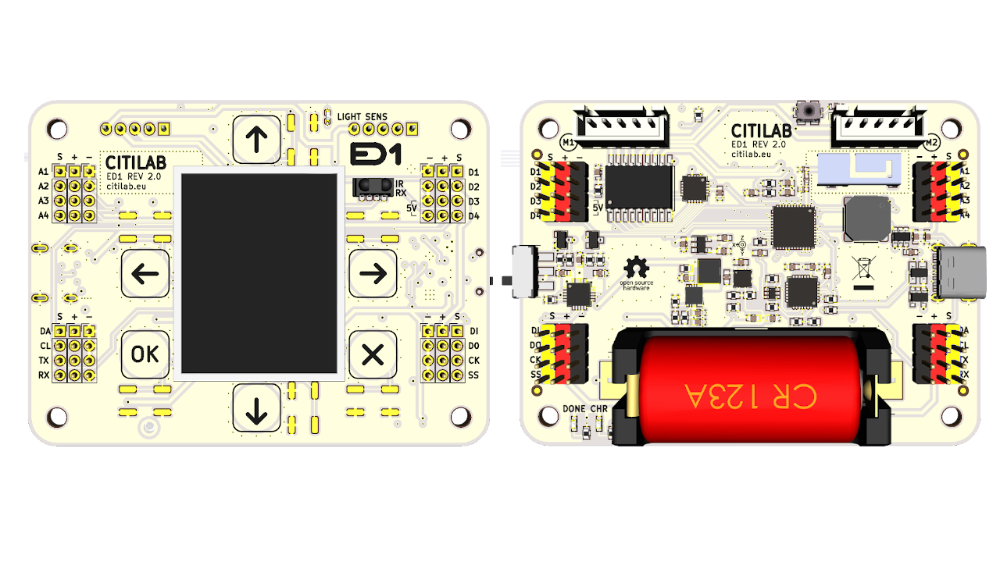
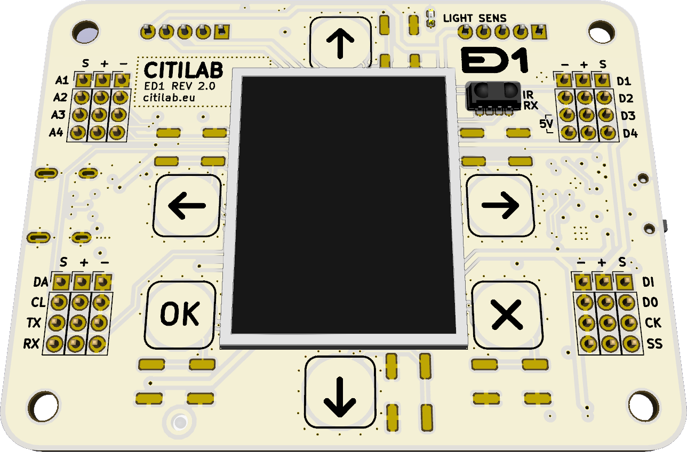
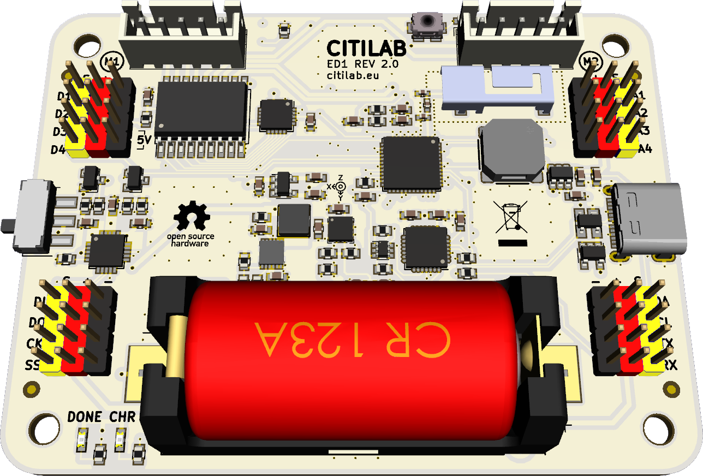

# ED1 Citilab Board - Home Assistant Integration

[](LICENSE)
[](https://esphome.io)
[](https://github.com/glifocat/ed1-hoas/actions/workflows/esphome-check.yml)
[](https://www.espressif.com/en/products/socs/esp32)

ESPHome configuration for integrating the [ED1 Citilab](https://citilab.eu) ESP32 educational board with Home Assistant.



<p align="center">
  
  
</p>

> **Full documentation at [docs.glifo.cat](https://docs.glifo.cat/ed1-hoas/overview)** — hardware reference, ESPHome configuration guide, Home Assistant dashboards & automations, SmartIR integration, and more.

## Features

- **1.44" TFT Display** (ST7735) — device status, IP, temperature
- **6 Capacitive Touch Buttons** — binary sensors in Home Assistant
- **Light Sensor** — ambient light percentage
- **Buzzer** — PWM audio output + RTTTL melodies
- **IR Receiver** (38kHz) — remote control & SmartIR bridge
- **LED Matrix** (WS2812) — addressable RGB light via GPIO12
- **Stepper Motors** (2x 28BYJ-48) — via MCP23009 I/O expander
- **Bluetooth Proxy** — extends Home Assistant BLE range
- **WiFi Signal, CPU Temperature, Uptime** sensors

Supports both **Rev 1.0** and **Rev 2.3** boards. See the [hardware reference](https://docs.glifo.cat/ed1-hoas/hardware/overview) for revision differences.

## Quick Start

1. **Clone and configure:**

   ```bash
   git clone https://github.com/glifocat/ed1-hoas.git
   cp secrets.sample.yaml secrets.yaml
   # Edit secrets.yaml with your WiFi and API credentials
   ```

2. **Choose a sample configuration** and copy it along with `secrets.yaml`, `fonts/`, and `packages/` to your ESPHome config directory.

3. **Flash via ESPHome add-on** — the device auto-discovers in Home Assistant.

**[Full setup guide →](https://docs.glifo.cat/ed1-hoas/quick-start)**

### Sample Configurations

| File | Description |
| ---- | ----------- |
| `ed1-message.sample.yaml` | Message display with chat log (recommended) |
| `ed1-mqtt.sample.yaml` | Dashboard with MQTT messaging |
| `ed1-status.sample.yaml` | Status display (WiFi, sensors, uptime) |
| `ed1-smartir-detector.yaml` | IR code detector for SmartIR (Rev 2.3) |
| `ed1-smartir-detector-rev1.yaml` | IR code detector for SmartIR (Rev 1.0) |
| `ed1-robot-demo.yaml` | Interactive stepper motor robot demo |
| `ed1-stepper-test.yaml` | Stepper motor testing and calibration |
| `ed1-gpio-test.yaml` | MCP23009 GPIO diagnostic tool |

## Prerequisites

- [Home Assistant](https://www.home-assistant.io/) with [ESPHome Add-on](https://esphome.io/guides/getting_started_hassio.html)
- ED1 Citilab Board (Rev 1.0 or Rev 2.3)
- USB-C cable + [CP210x USB Driver](https://www.silabs.com/developers/usb-to-uart-bridge-vcp-drivers)

## File Structure

```
ed1-hoas/
├── ed1-*.yaml                     # Sample configurations
├── secrets.sample.yaml            # Credentials template
├── packages/                      # Modular ESPHome components
│   ├── core.yaml                  # ESP32, logger, API, OTA, WiFi
│   ├── hardware.yaml              # SPI and I2C buses
│   ├── display.yaml               # TFT ST7735 display
│   ├── display-colors.yaml        # Color palette definitions
│   ├── display-layout.yaml        # Screen layout constants
│   ├── display-settings.yaml      # Runtime display theme settings
│   ├── fonts.yaml                 # Fonts + Material Symbols icons
│   ├── buzzer.yaml                # PWM output + RTTTL melodies
│   ├── buttons.yaml               # 6 capacitive touch buttons
│   ├── sensors.yaml               # WiFi, uptime, temp, light sensors
│   ├── bluetooth.yaml             # BLE tracker + proxy
│   ├── ir-receiver.yaml           # 38kHz IR receiver
│   ├── ir-transmitter.yaml        # IR transmitter (Rev 1.0, experimental)
│   ├── led-matrix.yaml            # 32x8 WS2812B LED matrix
│   ├── mqtt.yaml                  # MQTT broker connectivity (optional)
│   └── stepper.yaml               # 28BYJ-48 stepper motors via MCP23009
├── fonts/                         # Pixelmix font (CC BY-NC-ND 3.0)
├── scripts/                       # Utility scripts
├── docs/                          # Hardware reference files
│   ├── images/                    # Board photos (CC BY-SA 4.0)
│   └── datasheets/                # Component PDFs
├── CONTRIBUTING.md
├── LICENSE
└── NOTICE
```

## Contributing

See [CONTRIBUTING.md](CONTRIBUTING.md) for guidelines.

## License

Apache License 2.0 — see [LICENSE](LICENSE) and [NOTICE](NOTICE) for details.

## Credits

- **Created & Maintained by**: [glifocat](https://github.com/glifocat)
- **Original Hardware Documentation & Advice**: [vcasado](https://github.com/vcasado)
- **ED1 Board**: [Citilab Edutec](https://citilab.eu)
- **Board Images**: [Citilab Market](https://market.citilab.eu/es/producte/placa-ed1/) (CC BY-SA 4.0)
- **ESPHome**: [esphome.io](https://esphome.io)
- **Pixelmix Font**: [Andrew Tyler](https://www.andrewtyler.net) (CC BY-NC-ND 3.0)

## Links

- [Full Documentation](https://docs.glifo.cat/ed1-hoas/overview)
- [ESPHome Documentation](https://esphome.io/)
- [Home Assistant](https://www.home-assistant.io/)
- [Citilab](https://citilab.eu)
